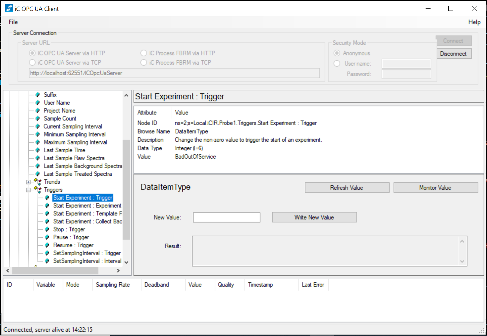

Shield: [![CC BY-NC-SA 4.0][cc-by-nc-sa-shield]][cc-by-nc-sa]

This work is licensed under a
[Creative Commons Attribution-NonCommercial-ShareAlike 4.0 International License][cc-by-nc-sa].

[![CC BY-NC-SA 4.0][cc-by-nc-sa-image]][cc-by-nc-sa]

[cc-by-nc-sa]: http://creativecommons.org/licenses/by-nc-sa/4.0/
[cc-by-nc-sa-image]: https://licensebuttons.net/l/by-nc-sa/4.0/88x31.png
[cc-by-nc-sa-shield]: https://img.shields.io/badge/License-CC%20BY--NC--SA%204.0-lightgrey.svg

# Sensing Sensitivity

This package is associated with the paper "ReactPyrR: A Python workflow for ReactIR allows for the quantification of the stability of sensitive compounds in air" by the Bell Group. Please see this manuscript for examples and further details of how the SensingSensitivity experiment functions. 

This repo allows users to conduct experiments monitoring the kinetics of degradation of air-sensitive compounds in air and includes liquid handling control via a [LSPOne Syringe Pump](https://amf.ch/product/lspone-laboratory-syringe-pump/), stirring via an IKA RCT Digital Hotplate and [ReactIR15 Spectrometer](https://www.mt.com/dam/product_organizations/autochem/reactir/ReactIR-15.pdf) through Mettler Toledo's [iCIR software](https://www.mt.com/gb/en/home/products/L1_AutochemProducts/automated-reactor-in-situ-analysis-software/ic-ir-instrument.html). 


All scripts created using Python 3.13.0. 

# Installation

Within the SensingSensitivity folder: 

    pip install -r requirements.txt

# Dependencies: 

IKA Stirrer hotplate (https://pypi.org/project/ika/)

LSPOne SyringePump (https://amf.ch/product/lspone-laboratory-syringe-pump/). Original code provided by supplier is included in supplier_pump.py. A newer version of this can be found here: https://pypi.org/project/AMFTools/

For use of this code the COM ports for the LSPOne and IKA hotplate must be identified using Device Manager and updated within SensingSensitivity.py on lines 55 and 344 respectively on first use. 

# ReactPyR
ReactPyR 2025 was developed by Mr Emanuele Berardi is licensed under Creative Commons Attribution-NonCommercial 4.0 International 

ReactPyR was developed to allow Python control of Mettler's ReactIR system via their iCIR software. 

This project was developed and tested using Windows 10 and on a ReactIR15 system and is written in Python3.13.0 using asyncua (pypi.org/project/asyncua/).All testing of ReactPyR was conducted with iCIR version 7.1.91 SP1 and iC OPC UA Client version 1.2.22. 

Node IDs were obtained using iC OPC UA. 


## Example Use
```Python
import asyncio
    from ReactPyR import ReactPyR

    # Example with all the above functionality.

    async def main():
        """The main event loop demonstrating basic function calls."""

        # Making the object.
        tcp_path = 'opc.tcp://localhost:62552/iCOpcUaServer'
        ir_machine = ReactPyR(opc_server_path=tcp_path)

        # Starting an experiment.
        template_name = 'SensingSensitivityTemplate'
        spectra_path = 'DSensing Sensitivity Project\\test1'
        await ir_machine.start_experiment(spectra_path, template_name, False)

        # Retrieving the intensities of previous background spectra.
        background = await ir_machine.get_last_background_spectra()

        # Collecting all the raw and processed IR spectra.
        await ir_machine.collect_raw_spectra()
        await asyncio.sleep(120)

        await ir_machine.collect_treated_spectra()

        # Changing sampling interval to 20 seconds.
        new_sampling_interval = 20
        await ir_machine.set_sampling_interval(new_sampling_interval)
        current_sampling_interval = await ir_machine.get_current_sampling_interval()
        if new_sampling_interval == current_sampling_interval:
            print('Sampling interval changed successfully.')

        # Pausing experiment for 20 seconds then resuming for another 20.
        await ir_machine.pause_experiment()
        await asyncio.sleep(20)
        await ir_machine.resume_experiment()
        await asyncio.sleep(20)

        # Stopping experiment
        await ir_machine.stop_experiment()

    asyncio.run(main())
```
# Data Processing

[ReactIR_Data Processing/READ ME.txt](https://github.com/user-attachments/files/21892078/READ.ME.txt)

ReactIR Data Processing was developed by Miss Marina Gladkikh is licensed under Creative Commons Attribution-NonCommercial 4.0 International 

The python scripts are designed to process data acquired from the ReactIR™ 15 spectrometer as csv files.

The scripts are designed to run from a directory containing a folder (CSV) of csv files output from the iCIR software.
You can simply copy and paste the scripts in the folder you're using.

The scripts are designed to create a folder called 'Results' that will contain two sub-folders: 'csvs' and 'plots'.
The 'csvs' folder will contain your excel and csv files. The former is for your convenience if you want to do something else with the data.
And the latter is used to generate all the post processed plots. 
The 'plots' folder contains all of the graphs that are generated during the running of the scripts divided into sub-folders - see below for a more detailed description.

All scripts created using Python 3.9.10.

You MUST pip install the requirements file from the SensingSensitivity folder. 

Alternatively install the following modules first via your computer console window (command prompt): 

numpy         2.1.1
pip           24.2
xlrd          2.0.1
openpyxl 	  3.1.5
matplotlib    3.8.0
pandas	      2.1.4

You can run the scripts individually or directly from the main.py function.

*** IMPORTANT - if running from main.py***

(1) Create an empty .py file called '__init__.py', save this in the same folder as where you're planning to run the rest of your scripts from.

(2) Ensure the ".CSV" files you want to process are in the same folder as the python scripts.

(3) Load up main.py and run it.
    To see how this works see the below breakdown of what each script does. Alternatively, detailed comments are provided in each "*.py" file.
 

*** IMPORTANT - if running scripts individually***

The zoom feature is not available! You will need to change the graph limits within the code manually to plot the data within the axes limits that you want.
The place where you should do this is indicated by means of comments in the scripts themselves. 

The scripts are designed to run in the following order. They are written as functions which are used in the main.py script. 
To implement them as is, scroll to the bottom of each "*.py" file, and call the function with all the relevant parameters.

  
(I) You MUST run the 'setup_dirs.py' script first! This creates all of your output directories and also pulls out .csv files from your ReactIR file dataset into a working
directory that the files will be taken from for later processing.

All files extracted or generated during the script operation will be in subfolders in the main folder called 'Results'. 
	
It also ensures that your files are saved as '.cvs' files as opposed to '.CSV' files which seems to be the default for ReactIR.
This avoids any issues that may occur with file reading later on in the code.

(II) Run 'raw_spectra_plotter.py' - This one takes all of your raw CSV files and plots intensity vs wavenumber in cm-1  
The script always uses the second column for plotting. 
The header of that second column is normally a timestamp, and that’s what gets shown in the plot title and also file name so that you can easily located the raw spectrum based on the desired time you want to look at.  
 
When you run the script, each plot has a fixed axis limits (defaults: x = 600–4000 cm⁻¹, and y = -0.5–1.7). 
The generated plots are saved as jpgs in the Results/plots/Raw Spectra folder.  

If you're using Spyder, you'll be able to see the plots as they are generated and can adjust the default axis settings either directly in the script.

(III) Run 'solvent_subtracted.py' - The scripts assume that you will run a blank at the start of every new experiment that, in our case, was just solvent. Thus we are interested only in solvent subtracted spectra. Thus, this script actually subtracts the solvent spectrum so you can see your "real" sample /product peaks more clearly.  
The script works by treating the first CSV that you feed in as your solvent spectrum/baseline. Every consequent CSV is then treated as a sample. For each sample, the solvent intensity is subtracted from the sample intensity, leaving a "clean" trace that’s easier to interpret.
The plots (Δ Intensity = Sample – Solvent) vs wavelength (cm-1) are again saved as jpgs in Results/plots/Solvent Subtracted Spectra. Plots are saved with filenames that include both the original sample name and the timestamp.
It also returns processed data which is used in later scripts (like the zooming one in 'main.py').  
Just like with the 'raw_spectra_plotter.py', if you run this script on its own you won’t be able to do the auto-zoom but you can change the axis limits directly in the code if needed.  

------------------------------------------------------------------------------------------------------------------------------------------------------------

(IV) 'user_zoom_mult.py' - This is integrated into the 'main.py' script and can be ran by itself but by altering the some of the previous scripts. However, I would say that it's much easier to adjust the limits in the scripts and rerun them instead. 

Anyways, this script is the interactive zoom feature. It takes the results from either the raw spectra plotter or the solvent-subtracted plotter and lets you zoom in on regions of interest before saving the zoomed-in plots.  
 
The script takes the returned 'results' from one of the scripts ran previously (either raw_spectra plotter.py or solvent_subtracted.py) as a point of origin. If you run the main.py script, you will see the initial plot first before you are asked if you want to zoom in or not. 
You will then be asked if you want to zoom in on the x-axis, then the y-axis and will be asked to provide limits for either.
If you don't supply the limits, the defaults will be kept for either axis.
The spectra will then be replotted and you will be asked if your plot looks right, if you say yes at this stage the new plot will be saved in a folder called 'Zoomed'; if not you can adjust the scales as many times as you'd like.

------------------------------------------------------------------------------------------------------------------------------------------------------------
			
(V) Run 'initial_final_scan_react.py' - This generates 3 solvent subtracted plots. One of the reaction at the start (aka with just your products), at the end (most likely reactants and products) and one that has your products only which is the intensities of the last scan - first scan.
To generate the "Initial Reaction Scan" plot the solvent (first csv) is subtracted from the reactants (second csv).

“Final Reaction Scan” plot is obtained by subtracting solvent (first csv) from the final scan (last csv)
					
To obtain the “Max Product in Reaction Scan" plot the reactant scan is subtracted from the last scan
				
All three use the same axis defaults x = 600–4000 cm⁻¹, y = -0.5, –1.7 with the plots being saved as jpgs to Results/plots/Data Processing Plots and also return a tuple of data which gets reused in subsequent scripts to enable trend extraction.

------------------------------------------------------------------------------------------------------------------------------------------------------------

(VI) 'user_zoom_by_one.py' - This has the same logic as the 'user_zoom_mult.py', however is used to allow you to tweak the axes of the plots generated by 			     'initial_final_scan_react.py'.
It keeps the same axis defaults x = 600–4000 cm⁻¹, y = -0.5, –1.7 and saves in the same place of Results/plots/Data Processing Plots so that everything is kept together. 

------------------------------------------------------------------------------------------------------------------------------------------------------------


(VII) Run 'peak_extractor.py' - This script allows you to extract the most intense peaks from your reactants and products and then track how those are changing over time.

Initially, the solvent is subtracted from all intensities across all data collection points and this information is stored in pandas dataframes
'extract_top_peaks(wavenumbers, intensity_series, num_peaks=6, exclusion_window=10)' function is then called - this looks at a spectrum and finds the biggest peaks below 1900 cm⁻¹ which avoids the diamond region of the probe.  
  			        
By default the code is set to extract the top 6 most intense peaks (and their wavelengths), and it makes sure each one is at least 10 cm⁻¹ away from the others so you don’t just end up with duplicates or shoulders of the same peak.  
This generates a list of target wavenumbers which is then used to loop through all the other csv files and extracts the intensities at the 6 specied wavelengths, it also extracts the associated time stamps and the file name from which the information is pulled.  
   			       
If you are not extracting the numbers you feel you should, you can always tweak the default tolerances. The places for where to do it are commented in on the code. 

Each of the above described extracted parameters is saved first as a DataFrame and then into its own Excel and csv file in the Results/csvs/Reactants (or Products). Each file is named after the peak wavenumber that the intensity has been extracted at.  

(VIII) Run 'vs_time_graphs.py' - Here we take the extracted csvs generated by peak_extractor.py and plot intensity over time. We also add linear trendlines with equations and R² values so you can see how well each peak follows a straight-line fit. If your kinetics don't follow a straight line fit, you can run the trend_predictor.py script separately at the end which will try fitting various other trendlines to your data instead.
				
You get individual plots of how the intensities at each wavelength change with time as well as a collated plot where all of them are on the same plot (with equations and R² values). The plot colours are controlled by colours.py 

(IX) ** Optionally run 'trend_predictor.py' - The code here has similar logic to vs_time_graphs.py, but now it’s separates out your reactants and products. 					      It takes the same intensities you've extracted at the specified wavelength, plots each peak over time with its trendline, and then makes a big combined plot with all peaks for each group. This is mostly a script to make your data look nice. You can tinker with the colour scheme and the way your trendline is displayed etc.

*** AUXILLARY SCRIPTS ***

(X) 'colours.py' - provides a colour scheme for the graphs that get plotted. Currently these are HEX codes for the colours used within the group but you can change these to be anything you want. 
Reactant trendlines use a more of a spring colour scheme and the product ones are autumnal  

